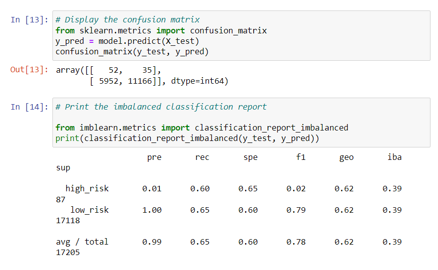

# Credit_Risk_Analysis
## Introduction
This project is on behalf of Jill, whom would like to **analyze credit risk via data preparation, statistical reasoning, and machine learning.** The data from this analysis comes form of CSV which provides loan status data. This was then split up into, creating the following:
* Credit risk resampling
* Credit risk ensemble
* Linear regression model
* Logical regression model
Of which, all of the former were run through Jupyter notebooks.
## Results
Within this project six different machine learning methods were utilized. These are used to show balanced accuracy scores, confusion matrix, and imbalanced classification repot. 
* Naive Random Oversampling (RandomOversampler)

* SMOTE Oversampling(SMOTE)

* Undersampling (ClusterCentroids)

* Combination(Over and Under) Sampling (SMOTEENN)

* Balanced Random Forest Classifier (BalancedRandomForestClassifier)

* Easy Ensemble AdaBoost Classifier (EasyEnsembleClassifier)

## Summary
Based on the former images and analysis of the results section, of the six types of models AdaBoosst Classifier is the best to use. It has the highest precision for high risk at 7% and recall at 91%. While the first few models had a precision score around 1%. Thus, AdaBoost Classifier would be the best to utilize for this data. 
